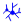

## Goal

The goal of this lab is to understand how neural lineages help to build functional circuitry. Though the function of some of these neurons isn’t completely understood, having a connectivity map can help us generate hypotheses about circuit function and also learn about the developmental origins of these circuits

With a stable internet connection open [CATMAID](http://tinyurl.com/larval-cns) to access the L1 brain. For how-to movies see the [first part of this module](catmaid01.qmd).

### Pick a lineage:

- NB3-3 [@Wreden2017]
- NB5-2 [@Heckscher2015]
- NB7-1 [@Kohwi2013]

### Load the neurons that were studied in @Mark2021

Click on this widget: 

1. Open Neuron Search widget (key binding )
2. Type in the "annotated" text field: **Mark et al. 2019**, push 

#### Add neurons from your lineage to the selection table

:::{#fig-selection-table}


Neurons from your Lineage to the Selection Table
:::

Double check in your selection table that all the neurons from the lineage are loaded** [published lineage neurons](https://drive.google.com/file/d/1JPg-cPQN9i4YtiMbE0aHh8WyEgmsy7vX/view?usp=sharing).

Open 3D Viewer widget (, click on all the neurons belonging to your lineage (e.g. A02b\_a1l, A02c?\_a1l, A02e\_a1l, A02g\_a1l, A02h\_a1l etc.), click "Append" from “Neuron search” in the selection table.

#### Rotate view and turn on Z plane\

:::{#fig-rotate-view}


Rotate View Turn on z Plane
:::

Tip:  at a point on the skeleton in 3D view to go to that point in the EM stack

#### Is your lineage homogenous or heterogenous?

Does it contain motor neurons, interneurons, sensory neurons or a mixture? Please show examples.

#### Find the entry point of the lineage into the neuropil and show it here:

#### Select a neuron that is the furthest from the entry point and one that is the closest.

Display them in different colors below

#### Is the neuron that is closest to the neuropil an early born neuron or a late born neuron?

Explain your rationale.

#### Do you think the early born neuron is part of the sensory or motor system?

Or a mix? Explain why:

#### Do you think the late born neuron is part of the sensory or motor system?

Or a mix? Explain why

#### For the early born neuron, show either a connectivity graph or display all pre- and post-synaptic neurons in different colors:

:::{#fig-connectivity}



Show a connectivity graph
:::

#### For the early born neuron, show either a connectivity graph or display all pre- and post-synaptic neurons in different colors:

For your pre- and post- synaptic of the early born neurons Export a movie and save it to your folder

:::{#fig-export}



Export a Movie
:::

## Useful widgets:

-  shows keyboard shortcuts
-  neuron search (‘/’ also opens this widget)
-  3D viewer of selected skeletons (use this in conjunction with the  widget to manage list of skeletons)
-  Display network of connectivity

## Fun search terms:

- Whole motor neurons at A1 segment akira
- DNs from Brain akira
- DNs from SEZ akira
- et al

## Other papers that have associated published neurons:

- @Zwart2016
- @Masson2020
- @Burgos2018
- @Eschbach2020
- @CarreiraRosario2018
- @Miroschnikow2018
- @Zarin2019
- @Mark2021
- @Berck2016
- @Eichler2017
- @Andrade2019
- @Larderet2017
- @Ohyama2015
- @Jovanic2016
- @Schlegel2016
- @Jovanic2019
- @Fushiki2016
- @Takagi2017
- @Tastekin2018
- @Imambocus2022
- @Kohsaka2019
- @Heckscher2015
- @Gerhard2017
