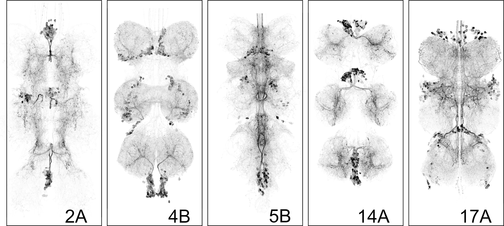

## Part 1: Lineage-Specific Optogenetic Activation in the Drosophila Ventral Nerve Cord

### Overview

This module tests a central principle of nervous system organization: Neural circuits are assembled from developmental building blocks called hemilineages that wire into stereotyped configurations and support distinct behavioral programs.
In _Drosophila_, each neural lineage arises from a single neuroblast and typically splits into two hemilineages. These hemilineages produce reproducible sets of neurons with characteristic projection patterns, neurotransmitter identity, and connectivity. Because developmental origin constrains morphology and synaptic partners, hemilineage identity biases each population toward participation in particular circuit motifs.

The key causal prediction tested in part I of this module is that if hemilineages assemble into distinct circuit units, then activating different hemilineages should produce distinct and repeatable motor outputs.

Students optogenetically activate lineage-defined neuronal populations in the ventral nerve cord (VNC) and observe whether developmental identity predicts behavioral output.

### Learning Outcomes

By the end of this module, students should be able to:

1. Explain what a neuronal lineage is.
2. Describe how the split-GAL4 system enables hemilineage-specific manipulations.
3. Explain how optogenetics can test sufficiency.
4. Interpret behavioral outputs critically.
5. Recognize the limitations of activation experiments.
6. Connect developmental origin to circuit function.

### Experiment Preparation

#### A. Retinal in Food (Required)

Channelrhodopsin (CsChrimson) requires retinal (a vitamin A derivative) as a cofactor to function. Flies must be raised on retinal-supplemented food for optogenetic activation to work. This ensures they are exposed to retinal during their life cycle. Wrap fly vials in foil to prevent unintended activation and maintain flies in the dark at room temperature. Review the protocol " Retinal Food Preparation" for details about how to prepare and store retinal fly media.

#### B. Fly Stocks

The fly genotypes used in this module are designed to restrict optogenetic activation to neurons belonging to a single, developmentally defined hemilineage in the ventral nerve cord (VNC). Fly lines (@tbl-hemilineage) are available from the Lacin Lab. Each experimental genotype contains the following core components: split-GAL4 Hemidrivers and a UAS-responsive optogenetic effector (CsChrimson) fused to mVenus.

Two separate transgenes encode a GAL4 hemidriver: one Activation Domain (AD) and one GAL4 DNA Binding Domain (DBD). Each hemidriver is expressed under the control of distinct regulatory elements. Only neurons that express _both_ hemidrivers reconstitute functional GAL4. In these lines, the combinatorial intersection occurs selectively in neurons belonging to a single hemilineage [@Soffers2025]. This enables hemilineage-level targeting based on developmental origin.

The UAS-CsChrimson-mVenus effector contains one critical component for the classroom demonstration: CsChrimson, which allows red-light-induced depolarization of targeted neurons. This causes the release of neurotransmitters into the synaptic cleft, and this neuronal activity propagates through downstream circuits so that a behavioral output is observed. (The mVenus is important for confocal imaging, when we use the membrane-bound GFP to visualize expression patterns when needed.)

Some hemilineage lines (e.g., 5B; @fig-lines) are maintained as stable stocks, in which all required genetic components are present in a single line. Other hemilineages (e.g., 2A, 17A, 14A; @fig-lines) require genetic crosses to combine the split-GAL4 hemidrivers and the UAS-CsChrimson effector. These crossed lines are typically maintained over balancer chromosomes, which carry visible markers (e.g., Bar eyes for the 1st chromosome (an indent or narrow slit) Curly wings for the 2nd chromosome and a Tubby body shape for the third chromosome). For experimental use, instructors must identify and select flies carrying the correct genotype. For instructors  versed in fly genetics, simply select against balancer markers to isolate progeny that contain both split-GAL4 hemidrivers and the UAS-CsChrimson effectors. Alternatively, instructors may briefly illuminate candidate flies and select individuals that show the expected activation phenotype.

:::{#fig-lines layout-ncol="1"}

{#fig-lines-a}

{#fig-lines-b}

GAL4 lines
:::

#### Cross Size, Fly Number Planning and Petri-dish preparation:

**Cross timing:** Flies eclose around 10 days after the cross was set, and adults can be kept for up to a week and ill still have a strong response.

**Parental setup per vial:** 10-15 virgin females × 5-10 males.

For hemilineages that require genetic crosses, we recommend setting several \~3 cross vials and passing them to fresh food every 2–3 days to maintain consistent output. Because selection against balancer markers reduces the number of usable flies, aim to produce at least 120 total adults prior to sorting. This will typically yield \~30 correctly genotyped flies per hemilineage for each student group. Approximately 30 correctly genotyped flies per hemilineage is typically sufficient for a standard class section and makes about 6 Petri dishes populated with 5 flies that can shuffle between the student groups. Depending on class size and the number of groups rotating simultaneously, instructors may wish to prepare more than one dishes.
We recommend keeping backup flies in reserve in the dark to replace animals that become overstimulated or unresponsive during repeated activation trials or get lost during dish handling accidents.

Optionally, instructors can prepare a set of decapitated flies. This step is not required but provides a compelling comparison. This optional manipulation isolates the VNC by removing brain input. Optogenetic activation in decapitated flies shows that the behavior can be driven by the ventral nerve cord independently of the brain.  Perform decapitation the afternoon before the experiment, since flies can survive up to 48 hours depending on the cleanliness of cut and duration of anesthesia. Procedure: Anesthetize flies on ice; Decapitate the flies using a razor blade or fine scissors by making a clean cut between head and thorax; Place flies in a Petri dish with damp paper towels to prevent dehydration through the neck wound, and maintain at room temperature.

| Hemilineage | Genotype | Behavior upon Optogenetic Activation |
| :---- | :---- | :---- |
| 2A | VGluT-GAL4AD/20x-UAS-CsChrimson.mVenus; Sox21A-GAL4DBD/+ | Wing buzzing |
| 4B | ap-GAL4AD/CyO;fkbDBD,0x-UAS-CsChrimson.mVenus/(TM6B) | Leg extension |
| 5B | 20x-UAS-CsChrimson.mVenus attP18/+; Vg-GAL4AD/CyO; Toy-GAL4DBD/In(4)Ci | Freeze |
| 14A | 20x-UAS-CsChrimson.mVenus/+; Dr-GAL4DBD/+; Toy-GAL4AD/+ | Falling over |
| 17A | Unc4-GAL4AD/FM7;; HMX-GAL4DBD/TM2 | Rogue leg spasms |

: Fly Stocks and Behavioral Outputs {#tbl-hemilineage tbl-colwidths="[10,60,30]"}

#### Interpreting Behavioral Outputs

The behavioral programs elicited by activating different hemilineages are not random motor effects. Each hemilineage produces a distinct and reproducible motor pattern, such an abrupt cessation of locomotion ("freezing"), stained rhythmic wing vibration ("wing buzzing"), repetitive leg movements ("leg spasms", or loss of postural control ("falling over"). Instructors are encouraged to review these clips prior to class to become familiar with the characteristic motor outputs. The recordings and confocal images showing CsChrimson-mVenus expression pattern are reproduced from: @Soffers2025, reproduced under CC-BY license. These responses are not generalized hyperactivity or random twitching, but coordinated motor outputs that reflect engagement of distinct downstream circuitry within the ventral nerve cord. These behaviors reflect engagement of different downstream circuit architectures within the ventral nerve cord.

If hemilineages were interchangeable or wired indiscriminately, activation would be expected to produce similar or chaotic motor outputs. Instead, the reproducibility and distinctiveness of these behaviors support the central principle tested in this module: developmental identity biases neurons toward participation in specific circuit motifs. In other words, hemilineages integrate into different functional circuits.

Thus, behavioral divergence serves as functional evidence that developmental origin constrains circuit architecture.

::::{#fig-behavior layout-ncol="3"}

:::{#fig-behavior-a}


Line 5B, example 1
:::

:::{#fig-behavior-b}


Line 5B, example 2
:::

:::{#fig-behavior-c}


Line 5B, example 3
:::

:::{#fig-behavior-d}


Line 5B, example 4
:::

:::{#fig-behavior-e}


Line 14A, example 1
:::

:::{#fig-behavior-f}


Line 14A, example 2
:::

:::{#fig-behavior-g}


Line 17A, example 1
:::

:::{#fig-behavior-h}


Line 17A, example 2
:::
Behavior
::::

### Classroom Execution

#### Lighting Conditions

We recommend conducting the experiments in a dimly lit room. However, the selected genotypes have been tested and the behaviors remain robust under low ambient light.

#### Blinded Experimental Setup

To preserve the integrity of the causal reasoning exercise, flies should be distributed into coded Petri dishes prior to class, and students should not know which hemilineage they are observing. This can be done the day before the class, or just before. The instructor should maintain a separate genotype key. Blinding prevents students from matching expected behaviors to genotype labels and instead requires them to infer lineage identity based solely on observed motor output. This reinforces the experimental logic of hypothesis testing: if developmental identity dictates circuit function, then distinct and reproducible behaviors should allow students to deduce genotype from phenotype.

* Label Petri dishes with coded identifiers.
* Students should not know which genotype they are observing. This introduces experimental controls and reduces bias.
* The teacher maintains a separate genotype key.
* Preparing the Flies
    1. Keep vials wrapped in foil until use.
    2. Place vials on ice to gently anesthetize flies.
    3. Transfer flies to a small (5 cm) Petri dish.

#### Student Observation

* Provide each group with a strong flashlight (see @tbl-equipment).
* When illuminated, each optogenetic activation of each genotype produces a distinct, reproducible behavior.
* Students use the Student Handout to record observations, compare behaviors and to match each behavioral output to a lineage.

#### Discussion and student engagement

### Suggested Teaching Script:

#### Introduction to Neuronal Lineages

* Explain how the brain is organized into clusters of neurons (lineages/hemi-lineages) derived from common progenitors.
* Highlight the anatomical and potential functional significance of these lineages, focusing on the _Drosophila_ ventral nerve cord (VNC).
* Connect to broader neuroscience concepts about circuit organization.

Experimental Approach: Optogenetic Activation and Split-GAL4 System
Objective: Describe the experimental tools students will use to study neuronal lineages.

* Overview of split-GAL4 genetic drivers for lineage-specific targeting.
* Explanation of optogenetics to activate neurons and observe behavioral outputs.
* Emphasize how this approach tests whether activating a hemilineage is sufficient to drive behavior.

Interpreting Experimental Results: Capabilities and Limitations
Objective: Encourage critical thinking about what the experiments reveal and their constraints.
This experiment demonstrates:

* Activation of a hemilineage can drive a specific motor output.
* Developmental units dictate functional behavior.
* Genetic tools allow precise manipulation.

However, it does not show:

* Which individual neuron is responsible.
* Whether these neurons are naturally active during behavior.
* Whether the lineage is necessary for the behavior.

Observed behaviors result from:

* Activation of the targeted hemilineage.
* Activation of downstream partner neurons (including other lineages).

Teachers can discuss and explain:

* Clarify that observed behaviors result from activation of the hemilineage and its downstream partners, including other lineages.
* Explain that this method does not pinpoint specific neurons responsible for behaviors or show natural activity patterns.
* Highlight that necessity cannot be established without additional techniques like silencing or ablation.

Extending the Inquiry: Advanced Tools and Questions
Objective: Introduce students to more sophisticated research tools and open questions.

* Discuss neuronal silencing methods (Kir2.1, TNT, Shibirets) and lineage-specific ablation (reaper expression).
* Introduce functional imaging (calcium imaging) to observe real-time neural activity.
* Frame these tools as ways to investigate necessity, connectivity, and circuit function.

## Part II

### Overview

This protocol guides students through the Neuroglancer interface to examine how neurons from different hemilineages contribute to premotor control of the tergotrochanteral motor neuron (TTMn) in the escape circuit.

### Learning Outcomes

This analysis reveals that neurons from multiple hemilineages converge onto the TTMn, demonstrating that lineage-defined modules are selectively incorporated into specific circuit motifs. Rather than acting as isolated units, hemilineages contribute distributed and functionally diverse inputs that collectively shape motor output.

### Overview of Dataset (for reference)

Presynaptic partners of the TTMn were identified from the MANC connectome v1.2 using a neuPrint query that extracts upstream neurons forming ≥10 synapses onto the TTMn (neuron ID: XXXXX). Neurons not assigned to a hemilineage were excluded from analysis. The resulting dataset is provided in @tbl-manc-ids, which includes neuron IDs, hemilineage identity, synapse counts, and neurotransmitter annotations.

A Neuroglancer link is provided that contains:

* The full EM volume as a structural reference;
* Neuropil outlines for anatomical context;
* The Giant Fiber (GF; neuron ID: XXXX);
* The TTMn (neuron ID: XXXXX);

* TTMn input, with neurons from each hemilineage assigned to separate layers;
* All neurons belonging to each hemilineage for the right hemisegment of T2 as reference populations, with each hemilineage assigned to its own. Follow this link to open Neuprint {@fig-neuprint-a}.

:::{#fig-optogenetics}

{#fig-neuprint-a}
:::

[https://clio-ng.janelia.org/\#\!gs://flyem-user-links/short/EscapeCircuit.json](https://clio-ng.janelia.org/#!gs://flyem-user-links/short/EscapeCircuit.json)

:::{#fig-giant-fiber layout-ncol="2"}

{#fig-gf-a}

{#fig-gf-b}

{#fig-gf-c}

{#fig-gf-d}

Giant Fiber
:::

### Classroom Execution

#### A. Orientation in Neuroglancer

1. Open the Neuroglancer link (see @fig-neuroglancer-a).
2. Identify the following elements: Left panel 1
   * **TTMn** (motor neuron; typically highlighted in orange)
   * **GF neuron** (command neuron; typically highlighted in blue)
   * **Neuropil boundaries**, focusing on the T2 neuromere
   * **Premotor input neurons** (loaded from the query dataset)
   * **Hemilineage reference neurons** (to evaluate the proportion of a hemilineage that synapses to the TTMn)
3. Adjust visualization settings:
   * Left window, eye icon: Toggle layers on/off to isolate specific neuron populations
   * Right window, Use transparency controls to visualize spatial overlap (see @fig-neuroglancer-d)
   * Rotate to a **dorsal view** for consistency with Figure 3

#### B. Identifying Premotor Inputs

4. Select individual hemilineage neurons from the dataset layer.
5. Trace their projections relative to:
   * The TTMn dendritic field
   * The GF axon
6. Use view toggles to:
   * Highlight synaptic contacts onto the TTMn
   * Compare morphology across neurons from different hemilineages

#### C. Linking Structure to Hemilineage Identity

7. Cross-reference selected neurons with @tbl-manc-ids:
   * Identify their hemilineage assignment
   * Note synapse counts onto TTMn
   * Record neurotransmitter identity
8. For each hemilineage:
   * Determine how many neurons contribute input to the TTMn
   * Estimate their relative contribution to total TTMn input

#### D. Guided Analysis (connect to main text questions)

Using the Neuroglancer view and dataset, address the following:

* Which hemilineages provide the strongest synaptic input to the TTMn?
* Does hemilineage 7B form direct synaptic contacts with the TTMn? Where are these located?
* Do neurons from the same hemilineage show similar or diverse morphologies?
* How are inputs spatially organized relative to the TTMn dendrites?
* Based on neurotransmitter identity, which hemilineages are likely excitatory vs. inhibitory?
* How might these chemical inputs interact with the fast electrical GF→TTMn pathway?

::: {#fig-neuroglancer layout="[[1],[1,1],[1,2]]"}

{#fig-neuroglancer-a}

{#fig-neuroglancer-b}

{#fig-neuroglancer-c}

{#fig-neuroglancer-d}

{#fig-neuroglancer-e}

Neuroglancer

:::

## Supplements

### Equipment List

:::{#tbl-equipment tbl-colwidths="[5,50,30,20]"}

| #  | Description              | Vendor         | Price ($) |
|----|:-------------------------|:---------------|-----------:|
| 1  | Red laser Light          | [Amazon](https://a.co/d/hvr3GUZ)         | $16       |
| 2  | Petri Dishes             |                |           |
| 3  | razor blades             |                |           |
| 4  | Nutrifly (10x 1l) 66-116 | [Genesee](https://www.geneseesci.com/product/nutri-fly-molasses-formulation-pre-mixed-fly-food/)        | $147.67    |
| 5  | all trans-Retinal 25 mg  | [Milipore Sigma](https://www.sigmaaldrich.com/US/en/product/sigma/r250) | $73.2      |
| 6  | fly vials                |                |           |
| 7  | premade fly food         |                |           |
| 8 | fly nap                  |                |           |

: Equipment List
:::

### Hemilineage

:::{#tbl-manc-ids tbl-colwidths="[10,45,45]"}
| **Hemilineage** | **Row Labels** | **Sum of c.weight** |
|-------|----------------|---------------------|
| 17A     | 11404          | 10                  |
| 08A     | 22549          | 12                  |
|         | 169711         | 10                  |
| 00A     | 16388          | 15                  |
|         | 17047          | 12                  |
| 12B     | 29239          | 33                  |
| 06B     | 10812          | 18                  |
|         | 11682          | 18                  |
| 16B     | 14424          | 59                  |
| (blank) | 10000          | 146                 |
|         | 10634          | 13                  |
|         | 24797          | 10                  |
|         | 225692         | 12                  |
| 13B     | 11111          | 161                 |
|         | 35435          | 17                  |
|         | 156615         | 10                  |
| 07B     | 14155          | 59                  |
|         | 16174          | 34                  |
|         | 16544          | 45                  |
|         | 18516          | 23                  |
|         | 20588          | 47                  |
|         | 101550         | 40                  |
| 20A.22A | 11530          | 86                  |
|         | 11877          | 102                 |
|         | 13081          | 58                  |
|         | 16156          | 10                  |
| 04B     | 15036          | 58                  |
|         | 16171          | 13                  |
|         | 16530          | 23                  |
|         | 16640          | 31                  |
|         | 16772          | 26                  |
|         | 19473          | 35                  |
|         | 21464          | 14                  |
|         | 22299          | 21                  |
|         | 101891         | 37                  |
| 18B     | 13645          | 26                  |
|         | 13846          | 156                 |
|         | 14882          | 22                  |
|         | 17245          | 21                  |
|         | 17824          | 10                  |
|         | 18131          | 14                  |
|         | 21171          | 22                  |
| 21A     | 15336          | 75                  |
|         | 16186          | 97                  |
|         | 16427          | 12                  |
|         | 17013          | 139                 |
|         | 17073          | 167                 |
|         | 17558          | 30                  |
|         | 18306          | 11                  |
|         | 20731          | 59                  |
|         | 20905          | 64                  |
|         | 24383          | 13                  |
|         | 27296          | 23                  |
|         | 28678          | 11                  |
|         | 36932          | 21                  |
|         | 101974         | 28                  |
|         | 152381         | 95                  |
| 13A     | 14366          | 256                 |
|         | 15024          | 178                 |
|         | 16681          | 90                  |
|         | 17350          | 183                 |
|         | 27506          | 14                  |
|         | 33275          | 136                 |
| **Grand Total** |                | 3291                |

Hemilineage

:::
