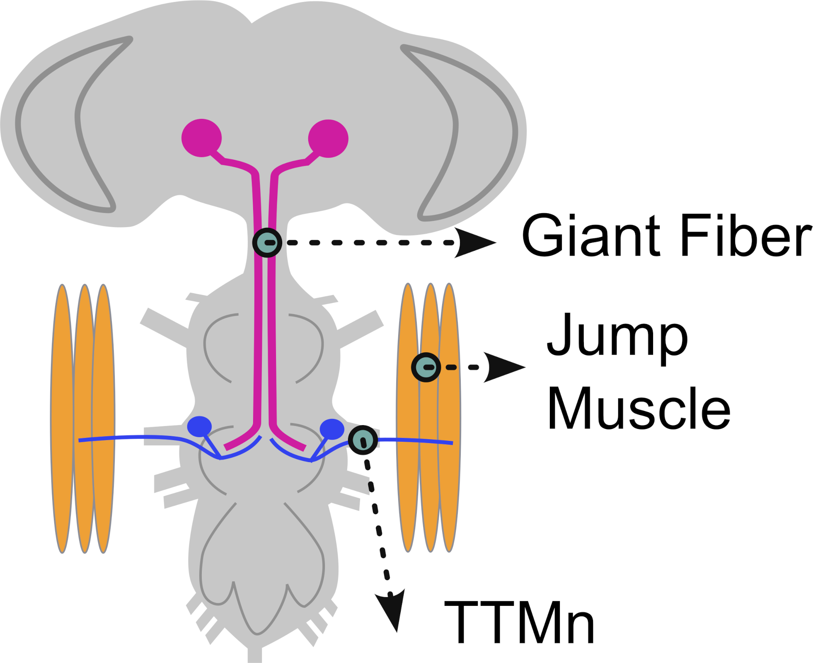
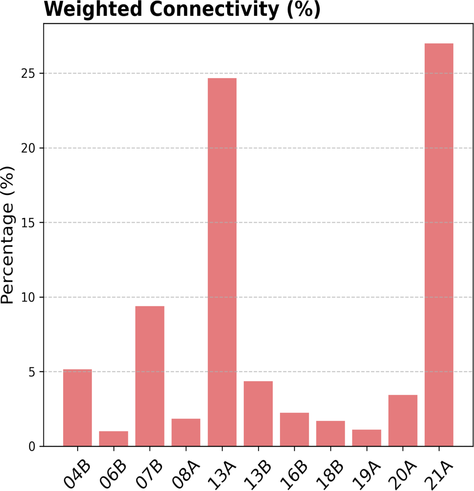
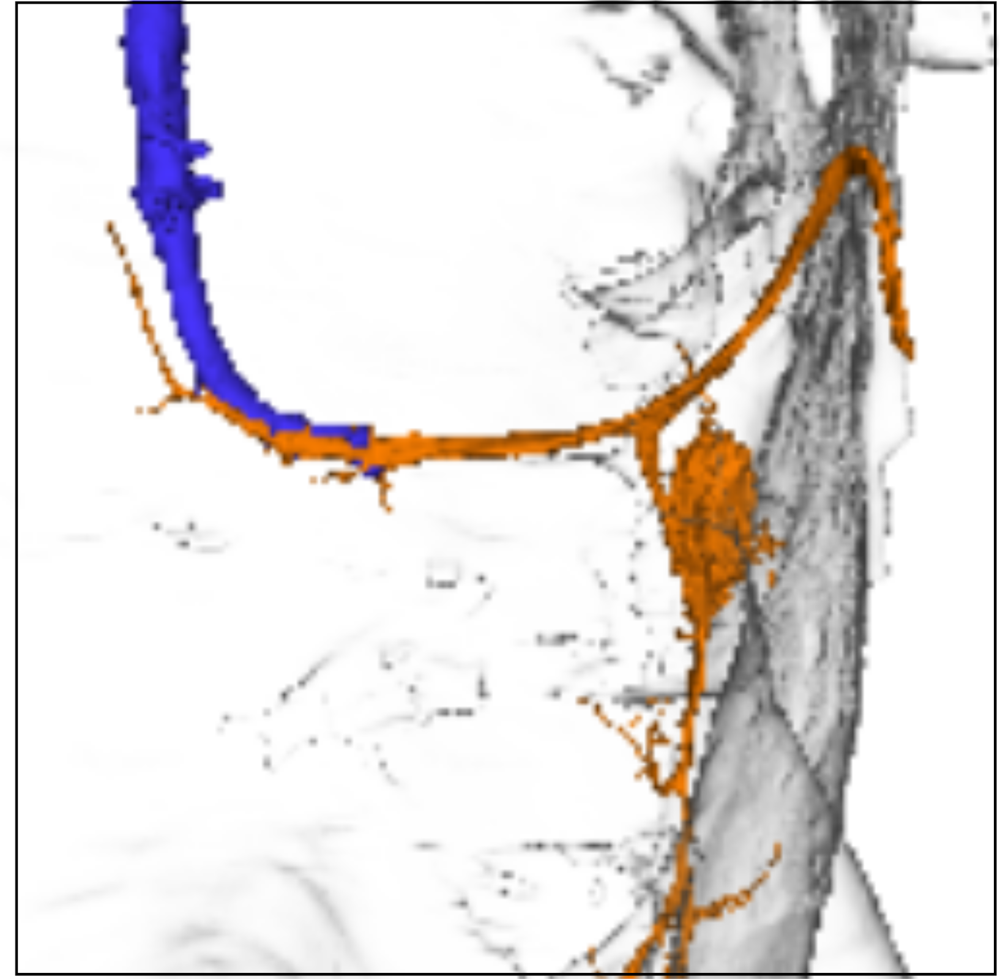
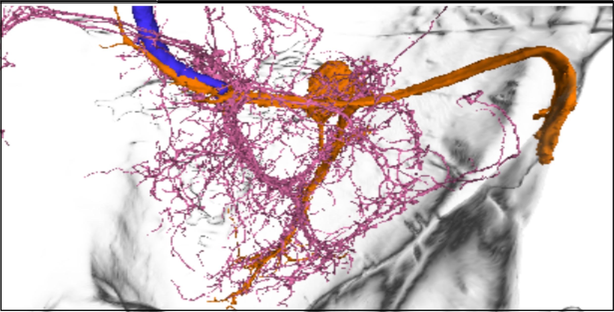
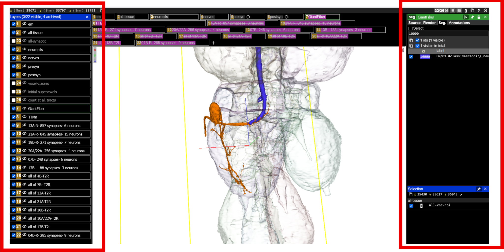
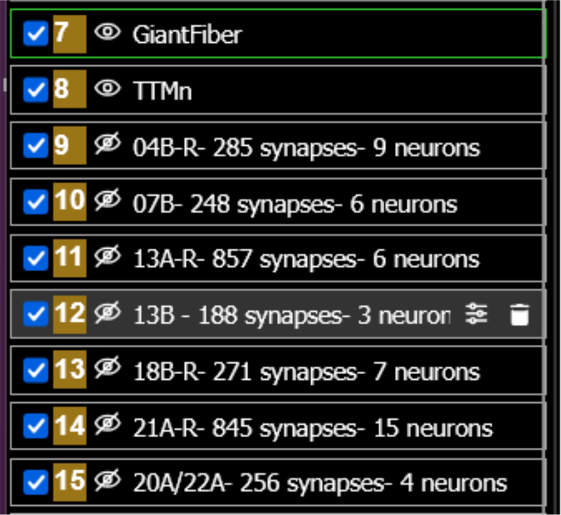
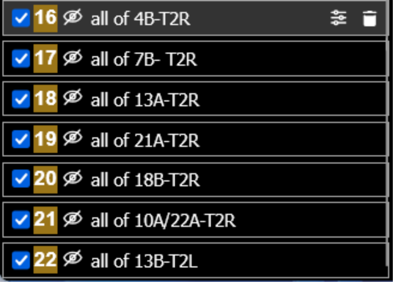
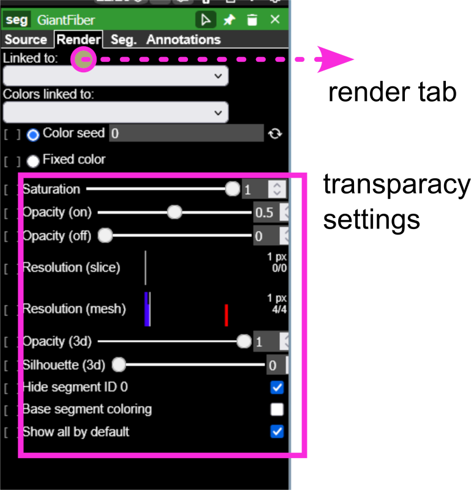
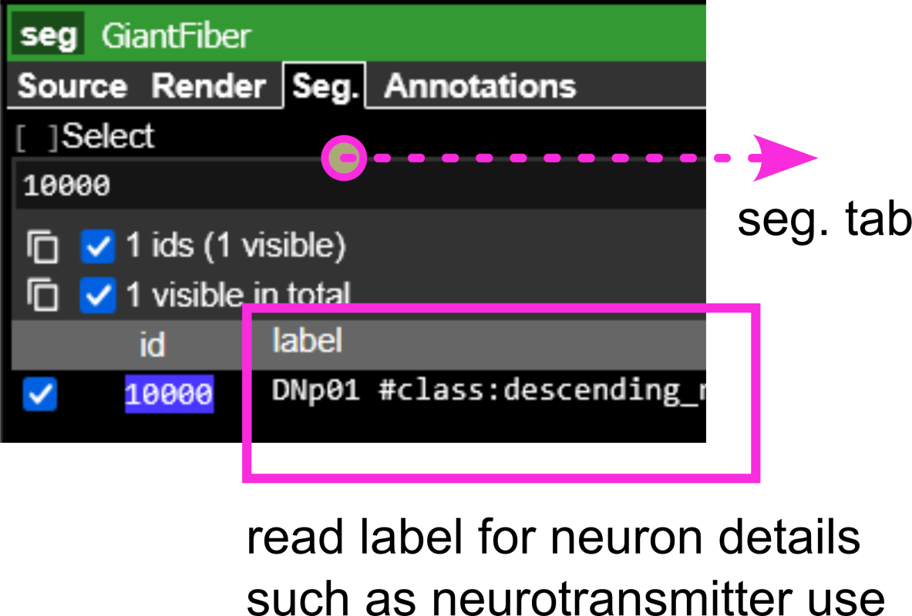

### Overview

This tutorial guides you through the Neuroglancer interface to examine the escape circuit.

First, you will first visualize the key neurons of this survival response. The giant fiber neurons that descend from the brain into the ventral nerve cord relay the sensory input that detects a looming stimulus, and relays it to the motor neurons that trigger the jump response. These motorneurons are called the tergotrochanteral motor neurons (TTMn's), after the tergotrochanter muscle they innervate, which is a leg extensor muscle.

Follow this [link](https://clio-ng.janelia.org/#!gs://flyem-user-links/short/GF-hemibrain.json) to look at the brain, and see the location of the cell bodies of the giant fiber neurons.

Next, you will investigate how neurons populations derived from different stem cells interact with these same motor neurons contribute to premotor control of the tergotrochanteral motor neuron (TTMn)

### Overview of Dataset (for reference)

Presynaptic partners of the TTMn were identified from the MANC connectome v1.2 using a neuPrint query that extracts upstream neurons forming ≥10 synapses onto the TTMn. Neurons not assigned to a hemilineage were excluded from analysis. The resulting dataset is provided in @tbl-manc-ids, which includes neuron IDs, hemilineage identity, synapse counts, and neurotransmitter annotations.

:::{#fig-optogenetics}

{#fig-neuprint-a}

[click to open Neuprint link](https://clio-ng.janelia.org/#!gs://flyem-user-links/short/EscapeCircuit.json) or scan the QR code.
:::

This link directs you to a viewer screen, which has a few items preloaded:

* The full EM volume as a structural reference;
* Neuropil outlines for anatomical context;
* The Giant Fiber (from the neck into the ventral nerve cord, the central brain is chopped off);
* The jump muscle motor neuron (TTMn);
* Neurons from specific neuronal populations (hemilineages) that synapse with the TTMn (AKA: TTMn premotor input);
* The complete hemilineage as reference (for thoracic segment 2).

:::{#fig-giant-fiber layout-ncol="2"}

{#fig-gf-a}

{#fig-gf-b}

{#fig-gf-c}

{#fig-gf-d}

Giant Fiber
:::

### Classroom Execution

#### A. Orientation in Neuroglancer

1. Open the Neuroglancer link (see @fig-neuroglancer-a).
2. Identify the following elements: Left panel 1
   * **TTMn** (motor neuron; typically highlighted in orange)
   * **GF neuron** (command neuron; typically highlighted in blue)
   * **Neuropil boundaries**, focusing on the T2 neuromere
   * **Premotor input neurons** (loaded from the query dataset)
   * **Hemilineage reference neurons** (to evaluate the proportion of a hemilineage that synapses to the TTMn)
3. Adjust visualization settings:
   * Left window, eye icon: Toggle layers on/off to isolate specific neuron populations (see @fig-neuroglancer-b, @fig-neuroglancer-c).
   * Right window, Use transparency controls to visualize spatial overlap (see @fig-neuroglancer-d)
   * Rotate to a **dorsal view** for consistency with Figure 3

#### B. Identifying Premotor Inputs

4. Select individual hemilineage neurons from the dataset layer.
5. Trace their projections relative to:
   * The TTMn dendritic field
   * The GF axon
6. Use view toggles to:
   * Highlight synaptic contacts onto the TTMn
   * Compare morphology across neurons from different hemilineages

#### C. Guided Analysis (connect to main text questions)

Using the Neuroglancer view and dataset, address the following:

* Which hemilineages provide the strongest synaptic input to the TTMn?
* Does hemilineage 7B form direct synaptic contacts with the TTMn? Where are these located?
* Do neurons from the same hemilineage show similar or diverse morphologies?
* How are inputs spatially organized relative to the TTMn dendrites?
* Based on neurotransmitter identity, which hemilineages are likely excitatory vs. inhibitory?
  Tip:
  * Acetylcholine (ACh) → excitatory
  * Glutamate (Glu) → often excitatory
  * GABA → inhibitory?
* How might these chemical inputs interact with the fast electrical GF→TTMn pathway?

#### D. Linking Structure to Hemilineage Identity (Advanced)

7. Cross-reference selected neurons with @tbl-manc-ids:
   * Identify their hemilineage assignment
   * Note synapse counts onto TTMn
   * Record neurotransmitter identity
8. For each hemilineage:
   * Determine how many neurons contribute input to the TTMn
   * Estimate their relative contribution to total TTMn input

:::{#fig-neuroglancer layout="[[1],[1,1],[1,2]]"}

{#fig-neuroglancer-a}

{#fig-neuroglancer-b}

{#fig-neuroglancer-c}

{#fig-neuroglancer-d}

{#fig-neuroglancer-e}

Neuroglancer

:::

### Hemilineage

:::{#tbl-manc-ids tbl-colwidths="[10,45,45]"}
| **Hemilineage** | **Row Labels** | **Sum of c.weight** |
|-------|----------------|---------------------|
| 17A     | 11404          | 10                  |
| 08A     | 22549          | 12                  |
|         | 169711         | 10                  |
| 00A     | 16388          | 15                  |
|         | 17047          | 12                  |
| 12B     | 29239          | 33                  |
| 06B     | 10812          | 18                  |
|         | 11682          | 18                  |
| 16B     | 14424          | 59                  |
| (blank) | 10000          | 146                 |
|         | 10634          | 13                  |
|         | 24797          | 10                  |
|         | 225692         | 12                  |
| 13B     | 11111          | 161                 |
|         | 35435          | 17                  |
|         | 156615         | 10                  |
| 07B     | 14155          | 59                  |
|         | 16174          | 34                  |
|         | 16544          | 45                  |
|         | 18516          | 23                  |
|         | 20588          | 47                  |
|         | 101550         | 40                  |
| 20A.22A | 11530          | 86                  |
|         | 11877          | 102                 |
|         | 13081          | 58                  |
|         | 16156          | 10                  |
| 04B     | 15036          | 58                  |
|         | 16171          | 13                  |
|         | 16530          | 23                  |
|         | 16640          | 31                  |
|         | 16772          | 26                  |
|         | 19473          | 35                  |
|         | 21464          | 14                  |
|         | 22299          | 21                  |
|         | 101891         | 37                  |
| 18B     | 13645          | 26                  |
|         | 13846          | 156                 |
|         | 14882          | 22                  |
|         | 17245          | 21                  |
|         | 17824          | 10                  |
|         | 18131          | 14                  |
|         | 21171          | 22                  |
| 21A     | 15336          | 75                  |
|         | 16186          | 97                  |
|         | 16427          | 12                  |
|         | 17013          | 139                 |
|         | 17073          | 167                 |
|         | 17558          | 30                  |
|         | 18306          | 11                  |
|         | 20731          | 59                  |
|         | 20905          | 64                  |
|         | 24383          | 13                  |
|         | 27296          | 23                  |
|         | 28678          | 11                  |
|         | 36932          | 21                  |
|         | 101974         | 28                  |
|         | 152381         | 95                  |
| 13A     | 14366          | 256                 |
|         | 15024          | 178                 |
|         | 16681          | 90                  |
|         | 17350          | 183                 |
|         | 27506          | 14                  |
|         | 33275          | 136                 |
| **Grand Total** |                | 3291                |

Hemilineage

:::
