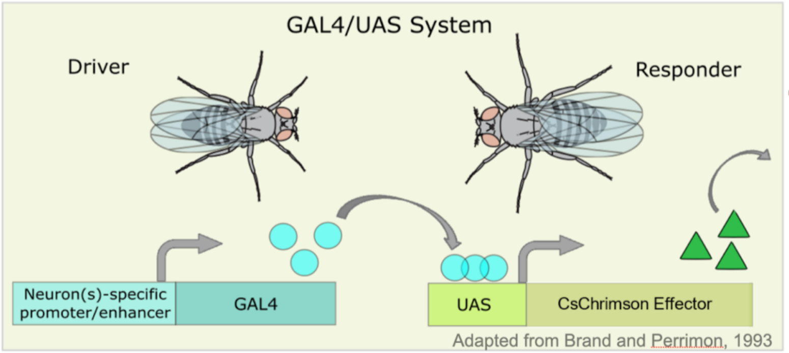
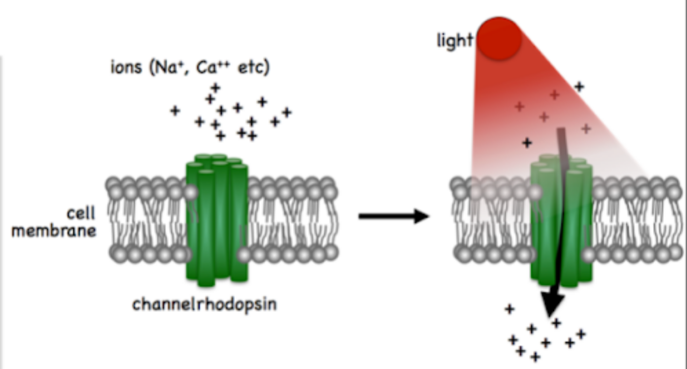
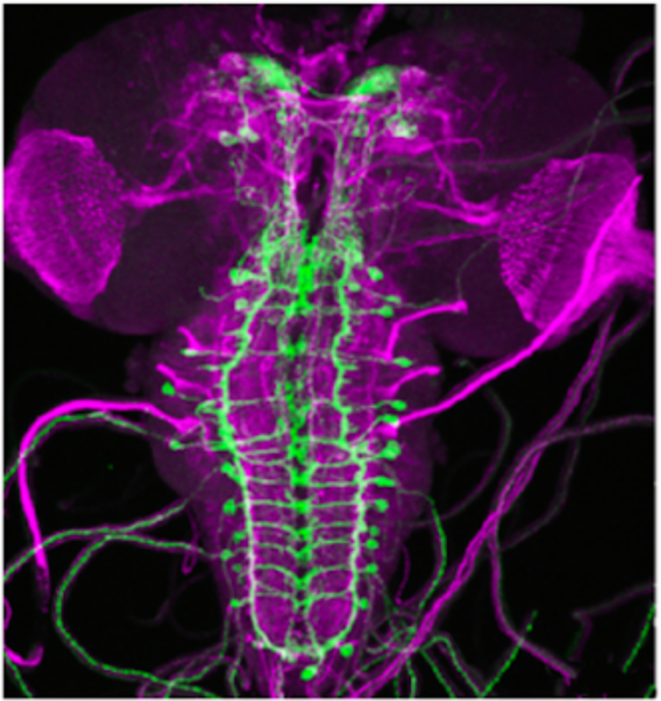

## Introduction to Optogenetics in Drosophila Larvae:

In this lab, we will explore the use of optogenetics, a technique that allows precise control of neuronal activity using light. By employing the GAL4/UAS system (@fig-opto-a), we can target specific neurons in *Drosophila melanogaster* larvae to express light-sensitive proteins like channelrhodopsins(@fig-opto-b). When exposed to specific wavelengths of light, these channelrhodopsins open ion channels, leading to neuronal activation or inhibition. Through this approach, we can observe and compare the resulting behavioral changes in experimental larvae, which have been genetically modified, against control larvae that have not. This experiment offers a hands-on opportunity to understand the functional role of specific neurons in controlling behavior.

:::{#fig-optogenetics layout="[[1],[1,1]]"}

{#fig-opto-a}

{#fig-opto-b}

{#fig-opto-c}

Optogenetics
:::

### Materials

- Drosophila crosses: Control and experimental flies
- Leica EZ4 stereo microscope
- water, paintbrush
- Behavior arenas

### Protocol

1. Connect and turn on the LED light source. Set up the Leica EZ4 stereo microscope with all 3 LED illumination then turn it off via the power switch in the back.
2. Warm to room temperature grape juice agar plates.
3. Collect a transgenic larval Drosophila expressing Channelrhodopsin and transfer an individual to the agar assay plate.
4. Allow larva to acclimate for \~1-2 minutes and then observe it crawling with the light off.
5. To stimulate neurons, turn on all 3 LED illumination for 4 seconds, and record the number of peristalic waves. Let the larva rest for 10 seconds and repeat 2 more times for a total of 3 trials. Repeat this for 4 additional larvae so the number of samples is 5 total.
6. For quantification, score for unique evoked phenotypes such as pausing, turning and reverse crawling behaviors during periods of LED stimulation versus no stimulation.
7. Compare rates of behaviors between stimulated and non-stimulated periods to evaluate effects of optogenetic stimulation on larval crawling. Compare rates of the control vs. the experimental. How are they similar? How are they different? Is one better to compare vs. the other?
8. Use excel/sheets to record your data and quantify and graph your results (hint: if you’re not sure try uploading it to [estimationstats.com](https://www.estimationstats.com/) to graph your results\!
